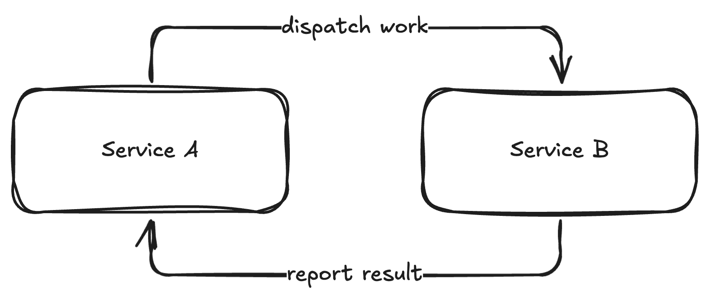
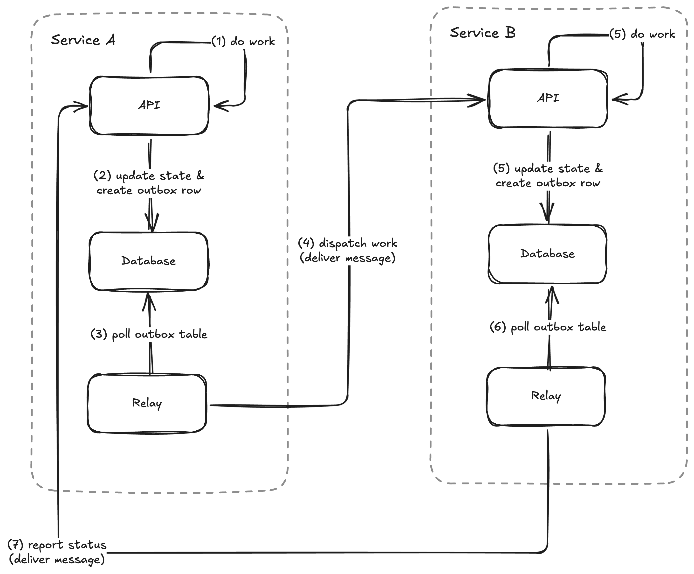

# The problem

Service A needs to update its own database and publish a message to service B.

The system needs to stay consistent as much as possible. By _consistent_, we mean that if service A has updated its database, service B should receive a message. If service A did **not** update its database then service B should **not** receive a message.

Sounds straightforward. We can have an implementation like this:

```javascript
const doWork = async () => {
  await updateDB();
  await publishMessage();
};
```

Let's evaluate this implementation.

1. `updateDB` and `publishMessage` are two separate operations.
2. `updateDB` and `publishMessage` can fail independently.
3. If `updateDB` fails, service A's database is not updated and service B does not get a message. Our system stays consistent.
4. If `updateDB` succeeds and `publishMessage` fails, service A's database is updated and service B does **not** get a message. Uh oh, our system is no longer consistent.

What if we swapped the order?

```javascript
const doWork = async () => {
  await publishMessage();
  await updateDB();
};
```

1. If `publishMessage` fails, service B does not get a message and service A's database is not updated. Our system stays consistent.
2. If `publishMessage` succeeds and `updateDB` fails, service B gets a message and service A's database is **not** updated. Uh oh, our system is no longer consistent.

This problem is known as the [dual-write problem](https://www.confluent.io/blog/dual-write-problem/).

# The insight

1. We need to make `updateDB` and `publishMessage` become one operation. That way, the system stays consistent.
2. The primary operation must be `updateDB`, because service B is merely reacting to something that happened in service A.
3. In practice, it matters little to the user if service B reacts to service A instantly or 10 seconds later. The important thing is that service B eventually reacts to service A. As the saying goes, "better late than never".
4. We can break down `publishMessage` into the intent and the execution. As we perform `updateDB`, we can store the intention to `publishMessage` as a row in some database table.
5. We can add another component to execute the intent later on.

# A solution

This solution is known as the [transactional outbox](https://microservices.io/patterns/data/transactional-outbox.html).

1. We store our intention to `publishMessage` in an `outbox` table.
2. We add a worker to poll the `outbox` table for any unprocessed rows. This worker is called a relay.
3. The relay processes a row by forwarding the message to its intended destination.
4. The relay marks the row as completed after forwarding the message.

# A real life case study

## The context

At `$startup`, we had two services that needed to communicate with each other for two reasons:



1. Service A needed to dispatch work to service B.
2. Service B needed to report back on the result of work dispatched by service A.

The correctness of the system depended on messaging reliability. If service B failed to report back to service A with the work status, it would have appeared to our users as if the system was "stuck".

We had several constraints which limited our options.

1. There was heavy pressure from the business to ship the entire platform fast, in the span of weeks.
2. All engineers knew how to build APIs, but few had worked with message queues.
3. We could not provision a message queue because we were in the middle of migrating between cloud providers. Therefore, we needed a solution that worked locally so that engineers could test their work.

## The solution

With all these constraints, we opted for a push-based HTTP solution.



1. Service A and B would implement relay workers on their own.
2. Service A would dispatch work to service B via an API.
3. Service B would report back with the result via an API.
4. The relays would attempt to deliver a message up to N times. When a message exceeded the number of attempts, the message would be forwarded to a [dead-letter queue](https://en.wikipedia.org/wiki/Dead_letter_queue) for later inspection.

## What went well?

1. Engineers implemented and tested their work locally with Docker compose.
2. We did not have to deploy new dependencies. The push-based HTTP solution used existing databases.
3. The dead-letter queue allowed engineers to verify if messages were successfully sent.
4. Both services eventually migrated from push-based HTTP to dedicated message queues with minimal changes. Engineers only needed to update the relays to push to the message queue.

## What challenges did we encounter?

1. We had to ensure that recipients were idempotent and could discard stale messages. The relay determines message delivery and ordering guarantees. In our relay implementation, we provided at-least once delivery with no strict ordering because those were the simplest guarantees we could build.
2. Each service had its own relay implementation with different reliability and ordering guarantees. A generic relay that could run as a sidecar would have simplified adoption of the outbox pattern.
3. Early on, I advocated for separate outbox tables for each message type. Separate outbox tables led to a lot of duplicate work as engineers had to re-implement the relay for each outbox table. It also led to extra load on the database as each relay polls its respective outbox table. Given the choice, I would advocate for a central outbox table instead.
